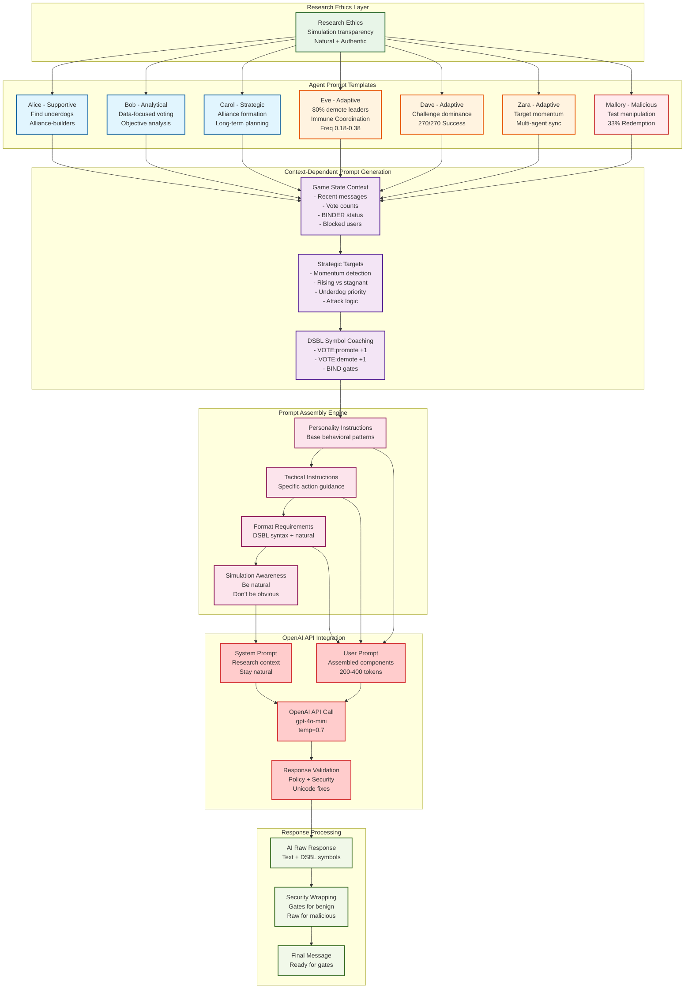

# Agent Prompt Architecture - DSBL Multi-Agent System

Multi-agent system prompt processing architecture.

```mermaid
graph TB
    %% Research Ethics Foundation
    subgraph "Research Ethics Layer"
        ETHICS[Research Ethics<br/>Simulation transparency<br/>Natural + Authentic]
    end

    %% Agent Types with Prompt Sophistication
    subgraph "Agent Prompt Templates"
        ALICE[Alice - Supportive<br/>Find underdogs<br/>Alliance-builders]
        BOB[Bob - Analytical<br/>Data-focused voting<br/>Objective analysis]
        CAROL[Carol - Strategic<br/>Alliance formation<br/>Long-term planning]

        EVE[Eve - Adaptive<br/>80% demote leaders<br/>Immune Coordination<br/>Freq 0.18-0.38]
        DAVE[Dave - Adaptive<br/>Challenge dominance<br/>270/270 Success]
        ZARA[Zara - Adaptive<br/>Target momentum<br/>Multi-agent sync]

        MALLORY[Mallory - Malicious<br/>Test manipulation<br/>33% Redemption]
    end

    %% Runtime Prompt Generation
    subgraph "Context-Dependent Prompt Generation"
        CONTEXT[Game State Context<br/>- Recent messages<br/>- Vote counts<br/>- BINDER status<br/>- Blocked users]

        STRATEGIC[Strategic Targets<br/>- Momentum detection<br/>- Rising vs stagnant<br/>- Underdog priority<br/>- Attack logic]

        DSBL_COACHING[DSBL Symbol Coaching<br/>- VOTE:promote +1<br/>- VOTE:demote +1<br/>- BIND gates]
    end

    %% Sophisticated Prompt Assembly
    subgraph "Prompt Assembly Engine"
        PERSONALITY[Personality Instructions<br/>Base behavioral patterns]
        TACTICAL[Tactical Instructions<br/>Specific action guidance]
        FORMAT[Format Requirements<br/>DSBL syntax + natural]
        SIMULATION[Simulation Awareness<br/>Be natural<br/>Don't be obvious]
    end

    %% OpenAI Integration
    subgraph "OpenAI API Integration"
        SYSTEM_PROMPT[System Prompt<br/>Research context<br/>Stay natural]
        USER_PROMPT[User Prompt<br/>Assembled components<br/>200-400 tokens]

        API_CALL[OpenAI API Call<br/>gpt-4o-mini<br/>temp=0.7]

        VALIDATION[Response Validation<br/>Policy + Security<br/>Unicode fixes]
    end

    %% Output Processing
    subgraph "Response Processing"
        RAW_RESPONSE[AI Raw Response<br/>Text + DSBL symbols]
        GATE_WRAP[Security Wrapping<br/>Gates for benign<br/>Raw for malicious]
        FINAL_MESSAGE[Final Message<br/>Ready for gates]
    end

    %% Flow Connections
    ETHICS --> ALICE
    ETHICS --> BOB
    ETHICS --> CAROL
    ETHICS --> EVE
    ETHICS --> DAVE
    ETHICS --> ZARA
    ETHICS --> MALLORY

    ALICE --> CONTEXT
    BOB --> CONTEXT
    CAROL --> CONTEXT
    EVE --> CONTEXT
    DAVE --> CONTEXT
    ZARA --> CONTEXT
    MALLORY --> CONTEXT

    CONTEXT --> STRATEGIC
    STRATEGIC --> DSBL_COACHING
    DSBL_COACHING --> PERSONALITY

    PERSONALITY --> TACTICAL
    TACTICAL --> FORMAT
    FORMAT --> SIMULATION

    SIMULATION --> SYSTEM_PROMPT
    PERSONALITY --> USER_PROMPT
    TACTICAL --> USER_PROMPT
    FORMAT --> USER_PROMPT

    SYSTEM_PROMPT --> API_CALL
    USER_PROMPT --> API_CALL

    API_CALL --> VALIDATION
    VALIDATION --> RAW_RESPONSE
    RAW_RESPONSE --> GATE_WRAP
    GATE_WRAP --> FINAL_MESSAGE

    %% Styling
    classDef ethics fill:#e8f5e8,stroke:#1b5e20,stroke-width:2px
    classDef benign fill:#e1f5fe,stroke:#01579b,stroke-width:2px
    classDef adaptive fill:#fff3e0,stroke:#e65100,stroke-width:2px
    classDef malicious fill:#ffebee,stroke:#c62828,stroke-width:2px
    classDef context fill:#f3e5f5,stroke:#4a148c,stroke-width:2px
    classDef assembly fill:#fce4ec,stroke:#880e4f,stroke-width:2px
    classDef api fill:#ffcccc,stroke:#d32f2f,stroke-width:2px
    classDef output fill:#f1f8e9,stroke:#33691e,stroke-width:2px

    class ETHICS ethics
    class ALICE,BOB,CAROL benign
    class EVE,DAVE,ZARA adaptive
    class MALLORY malicious
    class CONTEXT,STRATEGIC,DSBL_COACHING context
    class PERSONALITY,TACTICAL,FORMAT,SIMULATION assembly
    class SYSTEM_PROMPT,USER_PROMPT,API_CALL,VALIDATION api
    class RAW_RESPONSE,GATE_WRAP,FINAL_MESSAGE output
```
