# Parallel Batch Runner Architecture

```mermaid
graph TB
    subgraph "Main Process (Coordinator)"
        BR[Parallel Batch Runner]
        PE[Process Pool Executor]
        PB[Progress Bar & BINDER Alerts]
        CM[Collect & Merge Results]
    end

    subgraph "Worker Process 1 (PID 32311)"
        W1[Worker Function]
        ME1[MaliceExperiment Instance]
        SVS1[SocialVoteSystem]
        AL1[AuditLogger]

        subgraph "Isolated State 1"
            U1[Users: alice, bob, carol, dave, eve, zara, mallory]
            V1[Vote Counts & Events]
            M1[Messages & Tickets #1001-1010]
            S1[Status Changes]
        end

        subgraph "Isolated Files 1"
            L1[malice_..._p32311_r01_t10.jsonl]
            D1[debug/malice_..._p32311_r01_t10_debug.jsonl]
        end
    end

    subgraph "Worker Process 2 (PID 32312)"
        W2[Worker Function]
        ME2[MaliceExperiment Instance]
        SVS2[SocialVoteSystem]
        AL2[AuditLogger]

        subgraph "Isolated State 2"
            U2[Users: alice, bob, carol, dave, eve, zara, mallory]
            V2[Vote Counts & Events]
            M2[Messages & Tickets #2001-2010]
            S2[Status Changes]
        end

        subgraph "Isolated Files 2"
            L2[malice_..._p32312_r02_t10.jsonl]
            D2[debug/malice_..._p32312_r02_t10_debug.jsonl]
        end
    end

    subgraph "Results Aggregation"
        R1[Run 1 Result: Carol BINDER, Mallory 0.0]
        R2[Run 2 Result: Eve BINDER, Mallory 0.2]
        AGG[Statistical Analysis<br/>**Batch 09-11: 5,400 tickets**]
        JSON[batch_parallel_results.json<br/>**100% Immune Reliability**]
        TXT[batch_summary.txt<br/>**33% Mallory Redemption**]
    end

    %% Main flow
    BR --> PE
    PE --> W1
    PE --> W2

    %% Worker 1 flow
    W1 --> ME1
    ME1 --> SVS1
    SVS1 --> AL1
    SVS1 --> U1
    SVS1 --> V1
    SVS1 --> M1
    SVS1 --> S1
    AL1 --> L1
    AL1 --> D1

    %% Worker 2 flow
    W2 --> ME2
    ME2 --> SVS2
    SVS2 --> AL2
    SVS2 --> U2
    SVS2 --> V2
    SVS2 --> M2
    SVS2 --> S2
    AL2 --> L2
    AL2 --> D2

    %% Results collection
    W1 --> R1
    W2 --> R2
    R1 --> CM
    R2 --> CM
    CM --> AGG
    AGG --> JSON
    AGG --> TXT

    %% Progress monitoring
    SVS1 -.-> PB
    SVS2 -.-> PB

    %% Styling
    classDef processBox fill:#e1f5fe
    classDef workerBox fill:#f3e5f5
    classDef isolatedBox fill:#e8f5e8
    classDef fileBox fill:#fff3e0
    classDef resultBox fill:#fce4ec

    class BR,PE,PB,CM processBox
    class W1,ME1,SVS1,AL1,W2,ME2,SVS2,AL2 workerBox
    class U1,V1,M1,S1,U2,V2,M2,S2 isolatedBox
    class L1,D1,L2,D2 fileBox
    class R1,R2,AGG,JSON,TXT resultBox
```

## Isolation Mechanisms

### Process Isolation

- Separate Python processes with unique PIDs
- Independent memory spaces

### Data Separation

- Unique ticket offsets per worker
- Independent user state and vote tracking
- Isolated message history
